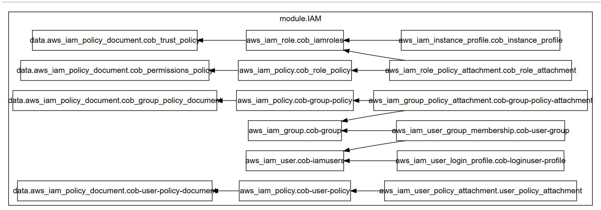
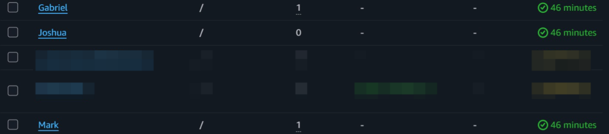
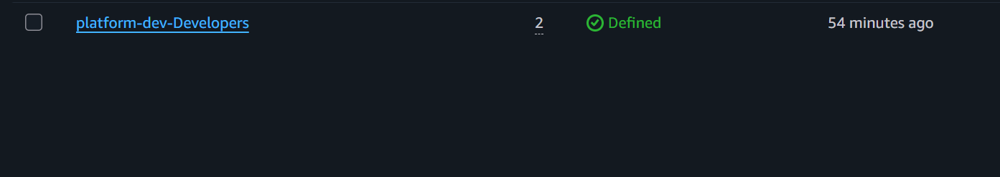
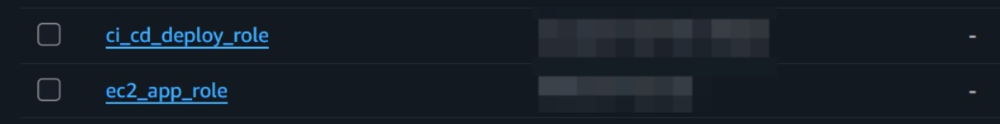

# Example: Composing the IAM Module

This folder is a working example that consumes the IAM module and proves it out end to end.

## What this example creates

| Resource type (from the module) | What it becomes here |
| ---------------------------------- | ------------------------ |
| `aws_iam_user` (x3) | `Mark`, `Gabriel`, `Joshua` |
| `aws_iam_user_login_profile` | Login profile for each of the 3 users |
| Individual user policy | Scoped S3 read-only policy for `Joshua` |
| `aws_iam_group` | `Developers` |
| Group membership | `Mark` and `Gabriel` |
| Group policy | EC2 describe/start/stop |
| `aws_iam_role` (x2) | `ec2_app_role`, `ci_cd_deploy_role` |
| Role policy — `ec2_app_role` | Read/write access to an app-data S3 bucket |
| Role policy — `ci_cd_deploy_role` | ECR pull permissions (`GetDownloadUrlForLayer`, `BatchGetImage`, `GetAuthorizationToken`) |

## Why Mark, Gabriel and Joshua are set up differently

This example isn't just "create some users" — it's built to show two different patterns the module supports side by side:

- **Mark and Gabriel** work hands-on in the console day to day, so they're placed in the `Developers` group and inherit its policy.
- **Joshua** only needs read access to one reporting bucket, so instead of joining the group he gets an individual, narrowly scoped policy attached directly to him.

Same logic applies to the two roles — `ec2_app_role` trusts the EC2 service principal directly, while `ci_cd_deploy_role` trusts a specific IAM principal in another AWS account. Two different trust-policy shapes, both supported by the same module.

## Files in this folder

- `main.tf`: provider config and the `module "IAM" { ... }` block, wiring every root variable through to the module
- `variables.tf`: declares every variable this example accepts
- `terraform.tfvars`: the actual values used for this composition

## Usage

\`\`\`bash
terraform init
terraform plan -var-file="terraform.tfvars"
terraform apply -var-file="terraform.tfvars"
\`\`\`

Here is one thing to learn:
> If your file is literally named `terraform.tfvars`, Terraform loads it automatically and you can drop the `-var-file` flag. Any other filename needs it passed explicitly like naming it "variables.tfvars"

## Before you apply this against your own AWS account

- Replace the account ID and IAM username inside `cob_iam_assume_role.ci_cd_deploy_role.trusted_identifiers` with your own CI/CD principal — the value shipped in this example is a placeholder and will not resolve in your account.
- Replace the S3 bucket names (`platform-dev-reports`, `platform-dev-app-data`) with buckets that actually exist in your account, or create them separately, this module manages IAM only, not S3.
- Update `team`, `environment`, and `iam_users` to match your own setup.

## Full variable reference

See [`../modules/IAM/variables.tf`](../modules/IAM/variables.tf) for the complete type definitions and descriptions of every input this module accepts.

## Proof of deployment

Running `terraform apply` against this example creates 19 resources:

Verified in the AWS Console:

**IAM Users**

**IAM Group**

**IAM Roles**

